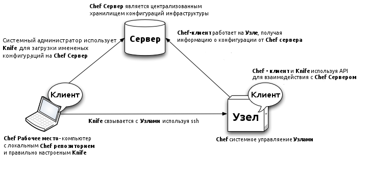
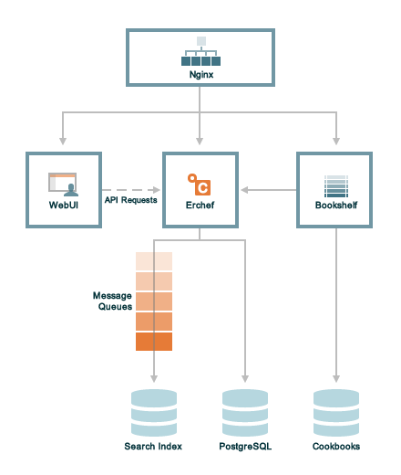

# Управляем конфигурацией с помощью Chef.  

## 1.Введение. Для чего используется Chef?  
Использование систем управления концигурацией ([SCM - Software Configuration Management](http://en.wikipedia.org/wiki/Configuration_management) ) в настоящее время обретает большую важность в работе IT подразделений. Осносной  причиной этого является рост парка машин, а также в компаниях часто встречаются не только разные версии операционных систем, но и различные дистрибутивы. Системы управления конфигурацией позволяют автоматизировать часть операций, выполняемых IT отделом.  
  
Если у нас есть необходимость утановить Apache на сервер, то возникает множество вопросов, таких как: какая операционная система стоит на сервере, какую версию нужно установить, где хранятся конфигурационные фалы, куда писать логи и т.д. Если сереверов будет не один а 10, то и вопросов может возникнуть в 10 раз больше.  

Конечно, для установки можно написать скрипт на bash/python/ruby/etс, но если в подчинении находится большой набор ОС и их версий, то написание скрипта может занять большое время.  

В настоящее время наиболее популяное [SCM ПО](http://en.wikipedia.org/wiki/Comparison_of_open_source_configuration_management_software) - это Chef, Puppet, Bcfg2 и Cfengine. В данной статье будет рассмотрен Chef.

 
## 2. Архитектура. 
При использовании Chef приходится иметь действие с тремя типами хостов: 
 
* Сервер (Chef-server) 
* Узел (Chef-client)
* Управляющая станция (Workstations)

  

### 2.1. Chef Server
**Chef Server** - это центральное хранилище конфигурационных данных. На сервере хранятся данные, применяемые к узлам.   
Начиная с версии 11.x Chef Server написан с использованием Erlang. Chef 11.x часто называют Erchef. На следющей диаграмме показаны соотношение компонентов Erchef:  

<table border="1">
  <tr>
    <td>Компонент</td>
    <td>Описание</td>
  </tr>
  <tr>
    <td>Bookshelf</td>
    <td>Bookshelf используется для хранения основных данных, необходимых для конфигурации узлов (cookbook), шаблонов и т.д. Если две версии одной поваренной книги (cookbook) имеют одинаковые файлы, то Bookshelf будет хранить этот файл только один раз.</td>
    
  </tr>
  <tr>
    <td>WebUI</td>
    <td>chef-server-webui это приложение, написанное на Ruby on Rails 3.0,  для функционировани веб-интерфейса сервера.</td>
  </tr>

  <tr>
    <td>Erchef</td>
    <td></td>
  </tr>

  <tr>
    <td>Message Queues</td>
    <td></td>
  </tr>

  <tr>
    <td>Nginx</td>
    <td>Nginx используется в качастве балансировщика нагрузки на сервер. Все запросы в API Chef Server проходят через него.</td>
  </tr>

  <tr>
    <td>PostgreSQL</td>
    <td>PostgreSQL является хранилищем данных на сервере.</td>
  </tr>
</table>
 

## 3. Сравнение с аналогами.

